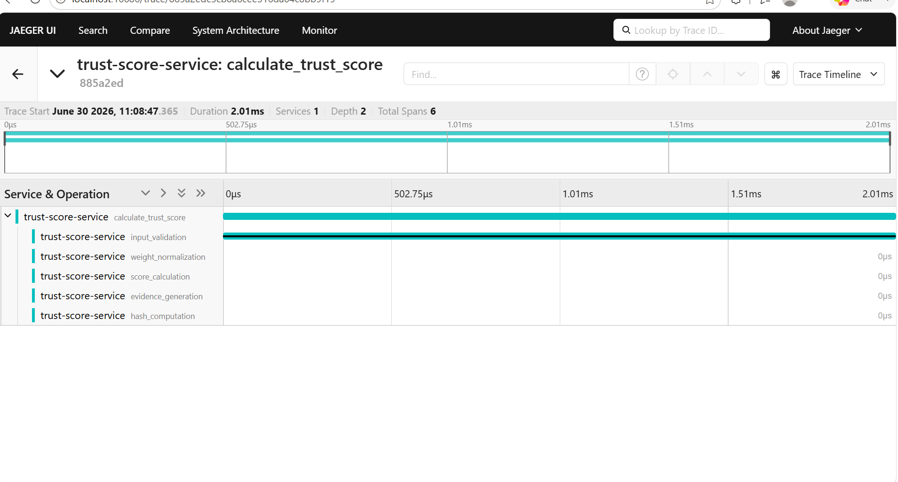

# Trust Score Calculator
This project calculates a Trust Score based on the following AI metrics:

* Reliability
* Safety
* Fairness
* Privacy
* Transparency
* Robustness

OpenTelemetry is used to trace each step of the Trust Score calculation, and the traces are visualized in Jaeger.

## Trace Flow

* Input Validation
* Weight Normalization
* Score Calculation
* Evidence Generation
* Hash Computation

All these steps are grouped under the parent span **calculate_trust_score**.

## How to Run

1. Start the Jaeger container.

2. Run the application:

   ```bash
   py trust_score.py
   ```

3. Open Jaeger:

   ```
   http://localhost:16686
   ```

4. Select **trust-score-service** and click **Find Traces** to view the trace.

## Tools Used

* Python
* OpenTelemetry
* Jaeger
* Docker
